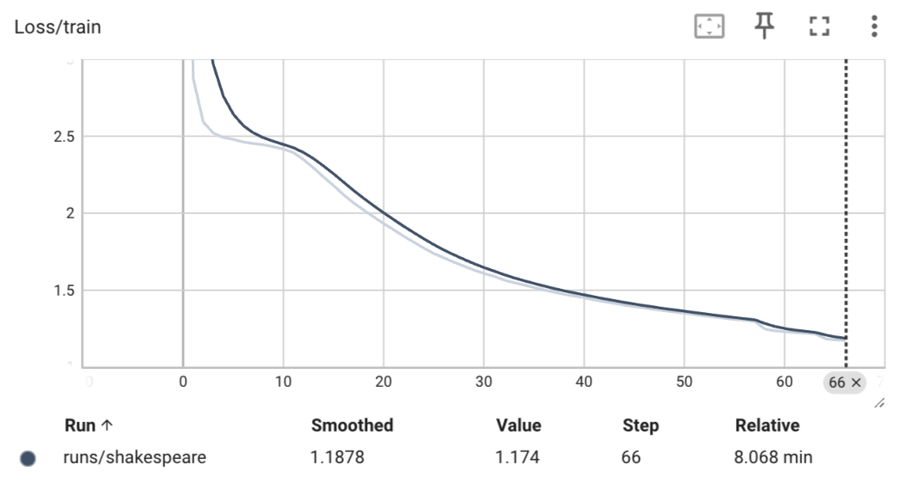
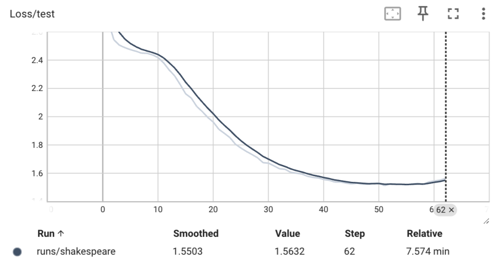

# tinyLLM: Collection of tiny LLM for educational purposes

## Introduction
The neural networks are loosely based on Karpathy's `nanoGPT` (available at: [https://github.com/karpathy/nanoGPT](https://github.com/karpathy/nanoGPT)), which have been a valuable learning tool for me. Another helpful tool has been the visual representation of the model architecture (available at: [https://bbycroft.net/llm](https://bbycroft.net/llm)).

This document is a sparse summary of the behavior of the model I trained. For tutorials on how to train your own models, Karpathy's videos on YouTube are a great resource (available at: [https://www.youtube.com/@AndrejKarpathy](https://www.youtube.com/@AndrejKarpathy)).


## Implementation Summary
The "LLM" is a composition of few decoder only transformer blocks and typical input and output layers found in LLM. For certain architectural choices, I have followed GPT-like approaches, e.g., using trainable token and positional embeddings, resue of token embeddings in the output layer etc. 

For smaller models like this, I found it difficult to get good results with generic cross-entropy. For example, lets say we are training the model to predict the sum of two numbers. In such cases, the loss should be based on the result it outputs only, not for the entire sequence. The custom loss function needs to be associated with the model. In this code, a thin wrapper of `nn.Module` is created with the `loss` function. This should be adapted to specialized used cases as necessary. 

## Example Model
The model implemented in `shakespeare.py` is a 3-transformer long tiny LLM. The model is trained on Shakespeare's works to predict the next character of a given prompt (data available at: [https://raw.githubusercontent.com/karpathy/char-rnn/master/data/tinyshakespeare/input.txt](https://raw.githubusercontent.com/karpathy/char-rnn/master/data/tinyshakespeare/input.txt)). Here is an example output of the model:

``` 
INPUT: 
we are accounted poor citizens, the patricians good. what authority surfeits on would relieve us:

COMPLETION (OUTPUT): 
the triumphesament to the seas of the world
the state of the strength of the wars of the seas
the banish'd the streth and the things.

capulet:
an of him that
```

Not bad for a small model trained on a Macbook to predict next character only with context length of 256 characters. The learning rate, train, and test loss looks as follows. 




Note that, the model gets overfitted after about 50 epochs, which might be related to the schedular used during optimizations. Also, compared to Karpathy's experiment with GPT-2 and Shakespeare data, this model shows better loss values. However, that is most likely due to the fact that this model is far smaller and I used only lower cases characters in the training data. Also, the model output is not really good either, it just looks "reasonable". 

## TODOs
- Implement actual output sampler
- Implement KV cache 